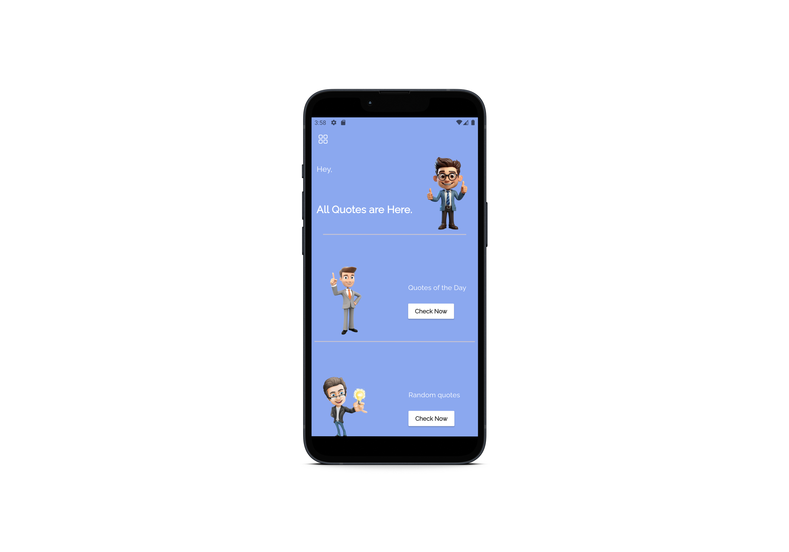

# Quotes App

This is a simple quotes app built using Flutter and GetX for state management. The app fetches quotes from an API and displays them in a clean and user-friendly interface.

## Preview


## Project Structure

```bash
lib/
│
├── constants/
│   └── app_constants.dart        # Defines application-wide constants such as colors, styles, strings, etc.
│
├── model/
│   └── quote_model.dart          # Defines the data model for a quote.
│
├── controller/
│   └── quote_controller.dart     # The GetX controller that handles business logic and state management for quotes.
│
├── services/
│   └── api_service.dart          # Handles API calls to fetch quotes from the external API.
│
├── screens/
│   ├── home_screen.dart          # Main screen where the quotes are displayed.
│   ├── quote_details_screen.dart # Screen to show detailed information of a selected quote.
│
├── widgets/
│   ├── quote_card.dart           # Custom widget to display a single quote in a card layout.
│   └── loading_indicator.dart    # Custom widget to show a loading state while fetching data.
│
└── main.dart                     # The entry point of the application.
